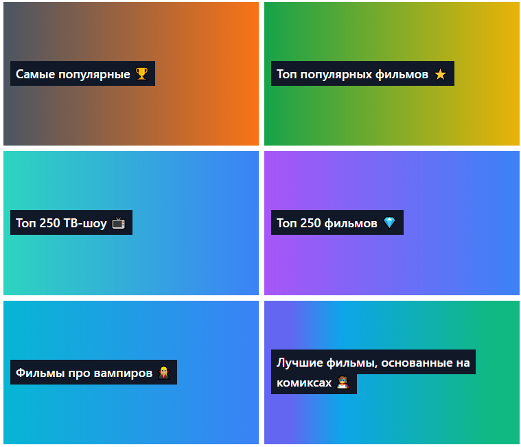

# Фильмотека

## Описание

Коллекция фильмов на основе [открытого API](https://kinopoiskapiunofficial.tech/), по данным "Кинопоиска".

## Демо

https://mchlv.ru/projects/filmoteka

## Цель проекта

Подробнее изучить кеширование в рамках Redux Toolkit, работу со структурой проекта, создание компонентов на Tailwind.

## Возможности

**Сделано** ✅:

-   Фильмы по рейтингам: самые популярные, топ популярных, фильмы про вампиров и другие.
-   Страница фильма:
    -   Описание
    -   Трейлеры
    -   Фото
    -   Факты
    -   Где посмотреть(онлайн)

**В планах** 🚀:

-   Раздел по актерам;
-   Поиск;
-   Избранная коллекция фильмов;
-   Личный кабинет пользователя;
-   ... добавить новые технологии и функционал.

## Стек

-   React + TypeScript
-   Redux Toolkit + RTK Query
-   Tailwind
-   Vite

## API

Используются данные [Kinopoisk Unofficial API](https://kinopoiskapiunofficial.tech/).
